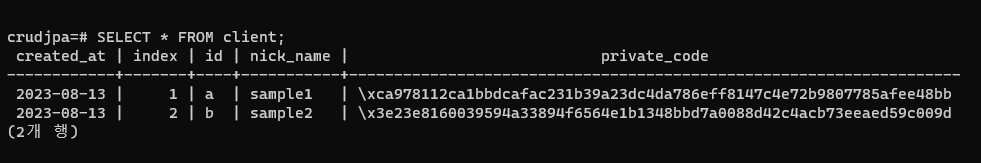
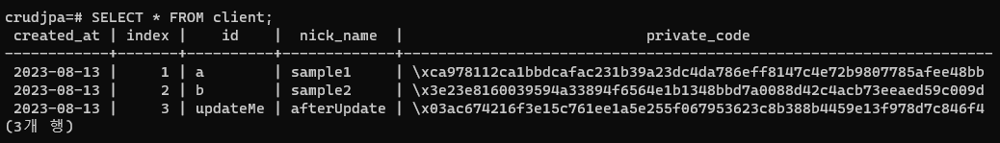
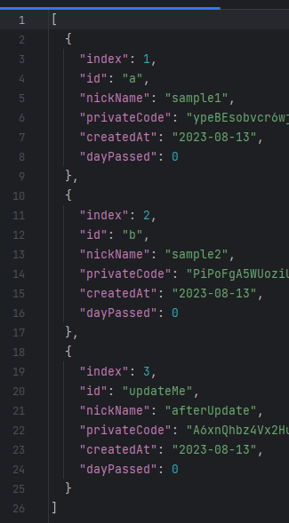

# sampleRequests
GET http://localhost:8080/api/v1/client

POST http://localhost:8080/api/v1/client/register
 
Content-Type: application/json
 
{
"id": "updateMe",
"privateCode": "1234",
"nickName": "beforeUpdate"
}

POST http://localhost:8080/api/v1/client/register
 
Content-Type: application/json
 
{
"id": "deleteMe",
"privateCode": "1234",
"nickName": "beforeDelete"
}

DELETE http://localhost:8080/api/v1/client/deleteMe?privateCode=1234

PUT http://localhost:8080/api/v1/client/updateMe?privateCode=1234&nickName=afterUpdate

GET http://localhost:8080/api/v1/client

# result

### before

### after

### get 

